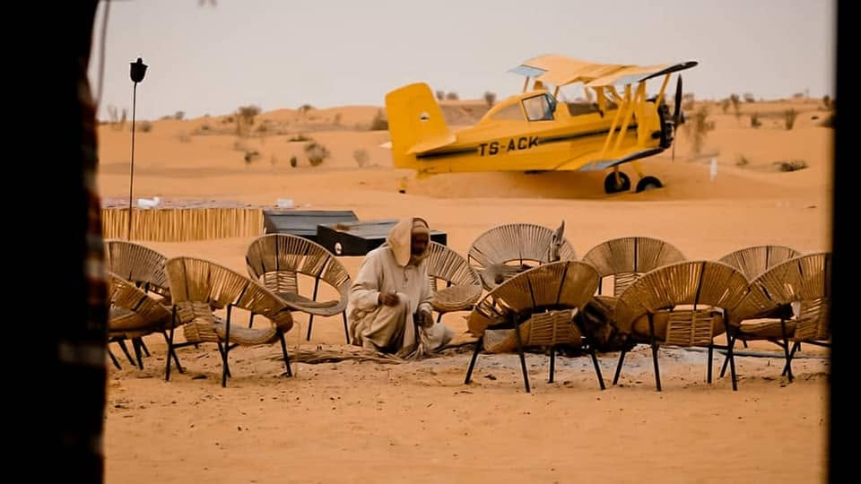

<!-- COVER set in build_pdf.py -->

---

# WHO WE ARE

**Depart Travel Services** is a licensed Tunisian Destination Management Company (DMC), based in Djerba, specialising in tailor-made and small-group cultural journeys across Tunisia.

We operate our **own insured vehicle fleet**, employ **ONTT-certified, English-speaking national tour leaders**, and have deep on-the-ground expertise across Tunisia's classical north, its Berber and Saharan south, and the living heritage of Djerba. We handle everything in-country — guiding, transport, accommodation, site logistics and 24/7 operational support — so that your clients' experience is seamless from arrival to departure.

**Founded by people who love Tunisia.** Our team has been running cultural journeys across this country for years, working with European tour operators and building relationships with the boutique hotels, Berber hosts, desert camp owners and local artisans who make a Tunisia trip genuinely memorable. We are not a booking desk — we are specialists.

---

# WHY CHOOSE DEPART TRAVEL SERVICES

## Guiding — the heart of the product
Tour-leader quality is the single most praised element of any small-group cultural trip. It is our headline commitment:

- **ONTT-certified, officially-licensed, English-speaking national tour leaders**, present arrival-to-departure
- Expert, narrative-driven storytelling — history brought alive, not recited from a script
- **Named guide bios and CVs supplied before contracting**; you may interview or meet the proposed guide before confirmation
- A small, vetted core team and a documented briefing standard per itinerary, so quality is consistent departure-to-departure

## Transport & fleet
- **Own insured vehicle fleet**: modern air-conditioned minibuses and coaches
- Vetted 4x4s for the desert and mountain oases
- **ONTT-approved, licensed, insured drivers** throughout

## Health, safety & crisis support
- Activities operated to local legal standards; annual route and supplier risk assessments
- **24/7 in-country assistance** and a local emergency-response protocol
- Vetted accommodation and restaurants; backup properties identified at each location

## Ethics & compliance
- Willing to sign your human-rights and ethical-procurement commitment (UN Guiding Principles, ILO Declaration)
- Animal welfare aligned with ABTA guidelines
- Local-benefit metrics reported in your format

## Responsible travel — *Thriving Nature, Thriving People*
- **~95% of accommodation locally owned**: boutique dars, heritage hotels, oasis guesthouses, Berber guesthouses, local desert camp
- **~90% of included meals at locally-owned restaurants** and family kitchens
- Direct, fair payment to artisans and hosts: Berber family homes, Guellala potters, Djerba weavers, desert-camp musicians
- Reusable water refills on board; solar lighting and waste policy at the desert camp
- Indicative **CO₂e per person per night** provided and ready to validate via **eCollective**; eligible for the **Lower Carbon Collection**

---

# WHY TUNISIA — AND WHY NOW

Tunisia delivers exactly what the adventure-travel customer wants: **world-class Roman heritage without the crowds, an authentic Berber south, a genuine Sahara night, and living Jewish-Berber island culture** — all in a compact, short-transfer loop, just 2.5–3 hours from the UK.

- **Roman heritage without the queues.** Dougga, El Jem, Sbeitla, Carthage — on a par with anything in Italy or Jordan, with a fraction of the crowd pressure.
- **The Sahara.** A camel ride into the Grand Erg Oriental and a night under the stars near Douz — one of the most memorable experiences in North Africa.
- **Berber culture.** Troglodyte villages at Matmata and Tamazret, the hilltop *ksar* of Chenini, overnight in a restored troglodyte house — authentic, unhurried, genuinely local.
- **Djerba.** The living Jewish-Berber heritage of El Ghriba, Houmt Souk, Guellala pottery, Djerbahood street art — a cultural island unlike anywhere else in the Mediterranean.
- **Practical.** Tunis in and out, compatible with UK/Europe scheduled services. Short internal transfers. Visa-free for most markets. Best in spring and autumn.

---

# OUR PRODUCT RANGE FOR EXODUS

We have designed two products specifically around the Exodus customer, grading systems, responsible-travel commitments and website format:

| Product | Duration | Activity Level | Comfort Level | From (illustrative) |
|---|---|---|---|---|
| **Grand Tunisia Journey** | 12 days / 11 nights | 3 — Moderate | Classic | £1,645 p.p. |
| **Highlights of Tunisia** | 8 days / 7 nights | 3 — Moderate | Classic | £1,195 p.p. |

Both are:
- **Land-only, Tunis (TUN) in and out** — compatible with UK/Europe scheduled services
- **No compulsory single supplement** — solo travellers paired same-sex at no extra cost
- **Guaranteed from 2 participants** — flexible for small parties
- **Responsible travel certified** — mapped to *Thriving Nature, Thriving People*

We also offer the full range below for tailor-made and private departures:

**① Roman Tunisia — Empires of the Sand** · 8 days · Easy · Classical heritage: Dougga, El Jem, Bulla Regia, Carthage, Sbeitla, Kairouan

**② Berber South & Sahara — Beyond the Map** · 8–9 days · Moderate · Ksour, Chenini, Matmata, Sahara camp, Berber encounters

**③ Flavours of Tunisia — A Culinary & Cultural Journey** · 7–8 days · Easy · Cooking with families, harissa and olive-oil producers, Andalusian Testour, Djerban fusion

**④ Walking Tunisia — Coast, Oases & Berber Trails** · 8 days · Moderate–Challenging · Soft-adventure walking routes, seasonal

*All itineraries available as private or tailor-made departures. Costed response within 72 hours on any brief.*

---
---

# GRAND TUNISIA JOURNEY — 12 DAYS

**New for 2026 — proposed product**
**Activity Level:** 3 — Moderate · **Comfort Level:** Classic · **Activity:** Culture

## Overview
**Roman ruins without the crowds, the Berber south and a night in the Sahara — the complete Tunisia in one compact loop.**

Over twelve immersive days we trace every layer of Tunisia's story: the mosaics of the Bardo and the ruins of Carthage, the crowd-free Roman cities of Dougga and Sbeitla, the holy city of Kairouan and the colossal amphitheatre of El Jem. We cross the Chott el Jerid salt lake to ride a camel into the dunes and sleep under the stars, meet Berber hosts in the troglodyte villages of the south, explore the living Jewish-Berber heritage of Djerba, and finish on the Mediterranean coast at Sousse and Hammamet.

## Key Information
- **Trip Code:** TGT
- **Duration:** 12 days / 11 nights
- **Countries:** Tunisia
- **Group size:** small group, typically 8–16 · guaranteed from 2 participants · also private/tailor-made
- **Flights:** land-only; **Tunis (TUN) in and out** — compatible with UK/Europe scheduled services
- **Carbon Footprint:** est. ~35 kg CO₂e per person per night (in-trip, excl. flights — indicative)
- **Best season:** Mar–May and Oct–Nov

## What's Included
- All accommodation: 11 nights (boutique/heritage *dar* & hotels, 1 night Sahara desert camp)
- All breakfasts; welcome dinner; desert-camp dinner; farewell dinner; touring-day lunches
- All ground transport in private A/C vehicle; 4x4 excursion (Day 5) and desert access (Day 6)
- Expert, ONTT-certified English-speaking tour leader throughout + local site guides
- All listed entrance fees
- Camel ride / dune activity at the desert camp
- Arrival and departure transfers
- Twin-share accommodation — **no compulsory single supplement**

## Highlights
- Discover crowd-free Roman Tunisia: **Carthage, Dougga, Sbeitla and the great El Jem amphitheatre**
- **Ride a camel into the Sahara** and sleep under the stars near Douz
- Meet Berber hosts in **Matmata, Chenini** and the ksour of the south
- Explore the **living Jewish-Berber heritage of Djerba** and the holy city of **Kairouan**

## Day-by-Day Itinerary

**Day 1: Adventure starts in Tunis**
Private airport transfer and welcome by our Tunis representative. Evening welcome briefing and group dinner in a restored medina townhouse.
*Accommodation:* Dar El Jeld / Villa Bleue (or similar) · *Meals:* Dinner

**Day 2: Tunis Medina, Bardo Museum, Carthage & Sidi Bou Saïd**
Guided walk of the UNESCO Tunis Medina, then the world-class **Bardo Museum** (the finest collection of Roman mosaics anywhere). Afternoon at the ruins of **Carthage** (Byrsa Hill, Antonine Baths). Sunset in blue-and-white **Sidi Bou Saïd**.
*Accommodation:* Dar El Jeld / Villa Bleue (or similar) · *Meals:* Breakfast, Lunch

**Day 3: Testour & Dougga • To Kairouan**
Drive west to the Andalusian heritage town of Testour. On to **Dougga (UNESCO)** — the best-preserved Roman town in North Africa. Lunch. Drive south to **Kairouan (UNESCO)**, Islam's fourth holiest city — old medina and Makroudh pastry.
*Accommodation:* Kasbah Kairouan 5★ (or similar) · *Meals:* Breakfast, Lunch

**Day 4: Kairouan & Sbeitla • To Tozeur**
Morning at the **Great Mosque of Kairouan** and Aghlabid basins. Drive to **Sbeitla (Sufetula)** — magnificent Roman forum and three temples. Lunch. Continue to the oasis town of **Tozeur**.
*Accommodation:* Tamerza Palace (or similar) · *Meals:* Breakfast, Lunch

**Day 5: Mountain Oases & Canyons**
4x4 excursion to the **mountain oases of Chebika, Tamerza and Midès** — canyons, waterfalls, palmeraies on the Algerian frontier. Visit the Mos Espa Star Wars film set (optional). Afternoon in the Tozeur old town.
*Accommodation:* Tamerza Palace (or similar) · *Meals:* Breakfast

**Day 6: Chott el Jerid • Night in the Sahara**
Cross the **Chott el Jerid** salt lake (mirage country). Arrive in **Douz** and visit the Bedouin Museum, then transfer to the **Sabria desert camp**. Camel ride into the heart of the dunes; campfire, Berber music, storytelling and a traditional dinner under the stars.
*Accommodation:* Sabria / Dunes Insolites desert camp (or similar) · *Meals:* Breakfast, Dinner

**Day 7: Tamazret, Matmata & a Troglodyte Night**
Leave the Sabria camp for the Berber highlands. Visit **Tamazret** and **Matmata** — famous for its underground troglodyte dwellings. Tonight: an authentic overnight in a **restored troglodyte house** at Au Trait d'Union, Tijma.
*Accommodation:* Au Trait d'Union, Tijma — troglodyte guesthouse · *Meals:* Breakfast, Dinner

**Day 8: Ksar Hadada, Chenini & to Djerba**
Among the ksour of the south: **Ksar Hadada** (a Star Wars filming location) and the dramatic hilltop Berber village of **Chenini**. Afternoon drive to the island of **Djerba** via the Roman causeway.
*Accommodation:* Dar Dhiafa (or similar) · *Meals:* Breakfast

**Day 9: Djerba Island (Cultural)**
**El Ghriba** — one of the oldest synagogues in the world; **Houmt Souk** old town and fishing port; **Guellala** pottery workshops; and the **Djerbahood** street-art quarter.
*Accommodation:* Dar Dhiafa (or similar) · *Meals:* Breakfast

**Day 10: El Jem & Sousse**
Drive north to **El Jem (UNESCO)** — the colossal Roman amphitheatre, one of the largest in the world. Lunch. Continue to **Sousse**; guided visit of the UNESCO medina and Ribat.
*Accommodation:* Dar Badiaa (or similar) · *Meals:* Breakfast, Lunch

**Day 11: Hammamet**
The Kasbah and Andalusian quarter of Hammamet; afternoon at leisure; optional hammam or **wine tasting at a local vineyard**. Farewell dinner.
*Accommodation:* Villa Zembra (or similar) · *Meals:* Breakfast, Dinner

**Day 12: Adventure ends in Tunis**
Departure transfer to Enfidha–Hammamet or Tunis–Carthage airport.
*Meals:* Breakfast

## Accommodation
Locally-owned boutique and heritage properties throughout. Proposed hotels by location *(or similar)*:

| Night(s) | Location | Proposed hotels |
|---|---|---|
| 1–2 | Tunis | Dar El Jeld · Villa Bleue, Sidi Bou Saïd · Hôtel Belvédère Fourati 4★ |
| 3 | Kairouan | Kasbah Kairouan 5★ |
| 4–5 | Tozeur | Tamerza Palace |
| 6 | Douz / Sabria | Dunes Insolites desert camp |
| 7 | Tijma (Matmata) | Au Trait d'Union — troglodyte guesthouse |
| 8–9 | Djerba | Dar Dhiafa · Dar Bhar · Villa Azur |
| 10 | Sousse | Mövenpick · Dar Badiaa |
| 11 | Hammamet | Villa Zembra · Dar Khayem Hotel |

Single rooms on request.

## Dates & Prices *(illustrative retail, excl. flights)*

**Open departures — choose your own dates.** Spring and autumn seasons (Mar–May and Oct–Nov). **Guaranteed from just 2 participants.**

- **From £1,645 p.p.** (twin share, excl. flights)
- **Optional private-room supplement:** +£345 *(no compulsory single supplement — solos paired same-sex at no cost)*
- **Private & tailor-made** dates available year-round on request

---
---

# HIGHLIGHTS OF TUNISIA — 8 DAYS

**New for 2026 — proposed product**
**Activity Level:** 3 — Moderate · **Comfort Level:** Classic · **Activity:** Culture

## Overview
**A short, immersive week — from the mosaics of Carthage to a night in the Sahara and a stay in a Berber troglodyte house.**

This compact loop packs the very best of Tunisia into eight days: the medina and Bardo mosaics of Tunis, the ruins of Carthage, the holy city of Kairouan, the palm oases and canyons of the south, a crossing of the Chott el Jerid salt lake to a desert camp in the dunes, the troglodyte Berber world of Matmata and Tamazret — with an authentic overnight in a troglodyte house — and finally the colossal amphitheatre of El Jem and the Mediterranean coast. Short transfers, uncrowded sites and genuine local encounters throughout.

## Key Information
- **Trip Code:** THT *(proposed)*
- **Duration:** 8 days / 7 nights
- **Countries:** Tunisia
- **Group size:** small group, typically 8–16 · guaranteed from 2 participants · also private/tailor-made
- **Flights:** land-only; **Tunis (TUN) in and out** — compatible with UK/Europe scheduled services
- **Carbon Footprint:** est. ~34 kg CO₂e per person per night (in-trip, excl. flights — indicative)
- **Best season:** Mar–May and Oct–Nov

## What's Included
- All accommodation: 7 nights (boutique/heritage hotels, 1 night desert camp, 1 night troglodyte guesthouse)
- All breakfasts; welcome dinner; touring-day lunches; desert-camp dinner; troglodyte-house dinner; farewell dinner
- All ground transport in private A/C vehicle; 4x4 excursion and desert access (Day 4)
- Expert, ONTT-certified English-speaking tour leader throughout + local site guides
- All listed entrance fees
- Arrival and departure transfers
- Twin-share accommodation — **no compulsory single supplement**

## What's Not Included
International flights · travel insurance · visas (most markets visa-free) · meals not listed · tips · optional activities · optional private-room supplement

## Highlights
- Tour crowd-free Roman Tunisia: **Carthage, El Jem and the holy city of Kairouan**
- **Cross the Chott el Jerid and sleep in a Sahara desert camp** among the dunes
- Discover the **troglodyte Berber world of Matmata & Tamazret** — with a night in a troglodyte house

## Day-by-Day Itinerary

**Day 1: Adventure starts in Tunis**
Arrival transfer and evening welcome dinner in a restored medina townhouse.
*Accommodation:* Dar El Jeld / Villa Bleue (or similar) · *Meals:* Dinner

**Day 2: Medina, Bardo, Carthage & Sidi Bou Saïd**
The UNESCO medina, the world-class Bardo mosaics, the ruins of Carthage and sunset in blue-and-white Sidi Bou Saïd.
*Accommodation:* Dar El Jeld / Villa Bleue (or similar) · *Meals:* Breakfast

**Day 3: Kairouan • To Tozeur**
The holy city of Kairouan — Great Mosque, old medina and Makroudh pastry — then on to the oasis town of Tozeur.
*Accommodation:* Tamerza Palace (or similar) · *Meals:* Breakfast, Lunch

**Day 4: Mountain Oases • Chott el Jerid • Sahara Camp**
4x4 to the mountain oases of Chebika, Tamerza and Midès, then cross the **Chott el Jerid** salt lake and head to the **Dunes Insolites** desert camp for a night among the dunes. Camel ride, campfire, Berber music and traditional dinner.
*Accommodation:* Dunes Insolites desert camp (or similar) · *Meals:* Breakfast, Lunch, Dinner

**Day 5: Sabria & Douz • Tamazret & Matmata • Troglodyte Night**
From Sabria to Douz (gateway to the Sahara), then into the Berber highlands of Tamazret and Matmata's troglodyte underground dwellings. Tonight: an authentic overnight in a **restored troglodyte house**.
*Accommodation:* Au Trait d'Union, Tijma — troglodyte guesthouse · *Meals:* Breakfast, Dinner

**Day 6: El Jem & Sousse**
Drive north to the colossal Roman amphitheatre of **El Jem (UNESCO)**, then the UNESCO medina and Ribat of **Sousse**.
*Accommodation:* Mövenpick / Dar Badiaa, Sousse (or similar) · *Meals:* Breakfast

**Day 7: Hammamet • Wine Tasting • To Tunis**
The Kasbah and Andalusian quarter of Hammamet, with a wine tasting at a local vineyard, then transfer to Tunis for the final night and **farewell dinner**.
*Accommodation:* Dar El Jeld / Villa Bleue (or similar) · *Meals:* Breakfast, Dinner

**Day 8: Adventure ends in Tunis**
Departure transfer to Tunis–Carthage airport.
*Meals:* Breakfast

## Accommodation
Locally-owned boutique and heritage properties throughout. Proposed hotels by location *(or similar)*:

| Location | Proposed hotels |
|---|---|
| Tunis | Dar El Jeld · Villa Bleue, Sidi Bou Saïd · Hôtel Belvédère Fourati 4★ |
| Kairouan / Tozeur | Tamerza Palace |
| Sahara / Sabria | Dunes Insolites desert camp |
| Tijma (Matmata) | Au Trait d'Union — troglodyte guesthouse |
| Sousse | Mövenpick · Dar Badiaa |

Single rooms on request.

## Dates & Prices *(illustrative retail, excl. flights)*

**Open departures — choose your own dates.** Spring and autumn seasons (Mar–May and Oct–Nov). **Guaranteed from just 2 participants.**

- **From £1,195 p.p.** (twin share, excl. flights)
- **Optional private-room supplement:** +£220 *(no compulsory single supplement — solos paired same-sex at no cost)*
- **Private & tailor-made** dates available year-round on request

---
---

# NET RATES — FOR EXODUS ADVENTURE TRAVELS

> **Illustrative figures (EUR).** The amounts below are a realistic working model to show how the rate grid behaves by group size. They are not a contracted quote — final net rates will be confirmed at contracting against live supplier costs and the agreed accommodation list.

## Grand Tunisia Journey — 12 Days

| Group size | Net land cost p.p. (twin share) | Single supplement |
|---|---|---|
| 2 pax (private) | **€3,595** | €420 |
| 3–4 pax | **€2,760** | €420 |
| 5–6 pax | **€2,095** | €420 |
| 7–9 pax | **€1,810** | €420 |
| 10–12 pax | **€1,595** | €420 |
| 13–16 pax | **€1,480** | €420 |

*Shoulder season (Mar–May / Oct–Nov). Net to Exodus, before Exodus margin and international air.*

## Highlights of Tunisia — 8 Days

| Group size | Net land cost p.p. (twin share) | Single supplement |
|---|---|---|
| 2 pax (private) | **€2,330** | €265 |
| 3–4 pax | **€1,790** | €265 |
| 5–6 pax | **€1,355** | €265 |
| 7–9 pax | **€1,170** | €265 |
| 10–12 pax | **€1,030** | €265 |
| 13–16 pax | **€955** | €265 |

*Shoulder season (Mar–May / Oct–Nov); low season approx. −10%. Net to Exodus, before Exodus margin and international air.*

**Free-place ratio:** 1 free tour-leader place per 15 paying pax · **Costed response within 72 hours** on any brief or specification change.

---

# RESPONSIBLE TRAVEL

*Aligned with Exodus's Thriving Nature, Thriving People framework.*

**Thriving People — local benefit:**
- ~95% locally-owned accommodation (boutique *dars*, oasis and island guesthouses, Berber guesthouse, local desert camp)
- ~90% of included meals at locally-owned restaurants and family kitchens
- Direct, fair payment to Berber hosts, potters, weavers and musicians
- Tunisian-owned suppliers, local guides and drivers throughout

**Thriving Nature — lower impact:**
- Small groups on uncrowded, off-peak sites reduce over-tourism pressure
- Desert camp: solar lighting, water-use limits, pack-in/pack-out waste policy
- Reusable water refills on board; no single-use plastic bottles
- Official entrance fees support UNESCO site preservation
- Indicative CO₂e per night; ready to validate via eCollective and flag for the Lower Carbon Collection

**Animal welfare:** fully aligned with ABTA Animal Welfare Guidelines. Camel encounters are welfare-compliant (well-kept working animals, limited ride duration, shade and water, no overloading) and always optional.

---

# READY TO WORK TOGETHER?

> ## ⏱ A costed response within 72 hours — guaranteed.

Tunisia is absent from your standalone range right now. These two products are designed to fill that gap — and we are ready to go.

**What we can do for you today:**

- **Send net rates and accommodation shortlists** for either or both products, tailored to your specifications
- **Provide full Trip Notes** (essential trip information, health and safety pack, accessibility notes) in your format
- **Arrange a call** with our product and contracting teams — and with the proposed guide(s)
- **Quote a bespoke brief** — different duration, grading, accommodation tier, or emphasis

**To get started:**

> **Email:** direction@depart-travel-services.com
> **Phone / WhatsApp:** +216 25 099 589
> **Website:** https://depart-travel-services.com/fr/

Send us your brief and we will respond with a costed proposal **within 72 hours**.

---

*Prepared by Depart Travel Services for Exodus Adventure Travels · June 2026*
*Depart Travel Services — Licensed Travel Agency (Tunisia) · Djerba*
