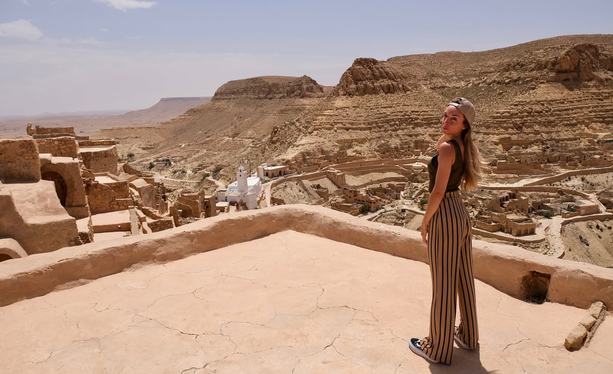
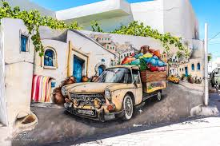

<!-- 📷 COVER IMAGE: Hero shot — El Jem amphitheatre at golden hour OR Sahara dunes at sunset -->

# TUNISIA — PRODUCT CATALOGUE FOR EXODUS ADVENTURE TRAVELS

### Prepared & presented by **Depart Travel Services** — Destination Management Company, Tunisia

**Date:** June 2026
**Status:** Product portfolio + flagship detailed build (The Grand Tunisia Journey, 12 days)

> **Depart Travel Services** is a licensed Tunisian DMC specialising in tailor-made and small-group cultural journeys. This catalogue presents our proposed product portfolio for Exodus Adventure Travels, with a fully detailed flagship itinerary.

**Contact:**
- **Company:** Depart Travel Services — Licensed Travel Agency (Tunisia)
- **Email:** direction@depart-travel-services.com
- **Phone / WhatsApp:** +216 25 099 589
- **Website:** https://depart-travel-services.com/fr/

---

## CONTENTS
1. Competitive analysis — where Tunisia stands vs Morocco, Jordan, Egypt, Turkey
2. USPs, underdeveloped themes & market gaps
3. Ideal Exodus customer profile
4. The flagship portfolio (5 products)
5. Commercial ranking
6. Head of Contracting verdict
7. **FLAGSHIP DETAILED BUILD — The Grand Tunisia Journey (12 days)**

---

## 1. COMPETITIVE ANALYSIS

Tunisia must earn shelf space against four mature, high-converting Exodus destinations. The key question is not "Is Tunisia beautiful?" but **"What does Tunisia let us sell that we cannot already sell better elsewhere?"**

| Theme | Morocco | Jordan | Egypt | Turkey | Tunisia's real position |
|---|---|---|---|---|---|
| Sahara desert | Strong but saturated | Wadi Rum (hero) | Hard logistics | None | Competitive, NOT differentiated |
| Roman / Classical heritage | Volubilis (one site) | Jerash (good) | Greco-Roman fringe | World-class | **Tunisia's #1 weapon — density + no crowds** |
| Berber heritage | Strong, commercialised | None | None | None | Strong & under-exploited |
| Layered civilisations | Good | Good | Pharaonic-dominant | Excellent | Outstanding, unique angle |
| Small footprint / short transfers | Long drives | Compact | Long + flights | Long | Major operational USP |
| Crowds / over-tourism | High | Petra very busy | Very high | High | **Uncrowded** |
| Food identity | Famous | Moderate | Moderate | Famous | Under-told story |
| Price / value | Rising | Expensive | Cheap-ish | Moderate | Excellent value |
| Brand awareness | Very high | Very high | Very high | Very high | **Tunisia's weakness ("beach package")** |

**Verdict:** Tunisia is NOT a desert destination first. Defensible positioning =
**"The undiscovered classical Mediterranean — Roman ruins without the crowds, the Berber south, and a layered cultural story, all in one compact, walkable country."**

---

## 2. USPs, GAPS & WHAT EXODUS LACKS IN NORTH AFRICA

**USPs (defensible):**
1. Roman archaeology density at near-zero crowds — El Jem (UNESCO), Dougga (UNESCO), Bulla Regia (underground villas, unique on earth), Carthage, Sbeitla.
2. Compactness — short transfers, low fatigue, high content-per-day.
3. Layered civilisations in a single loop (Phoenician → Roman → Byzantine → Arab → Ottoman → French).
4. Berber south without Morocco-level commercialisation.
5. Value + safety + ease (visa-free for target markets; ~2.5–3h from UK/Europe).

**Underdeveloped themes / gaps:** culinary storytelling; walking/soft-adventure cultural hybrid; "slow Tunisia" village stays; Roman-focused premium cultural touring.

**What Exodus lacks in North Africa today:**
- No "Roman North Africa" classical lead product.
- No short, compact, low-fatigue cultural week in the region.
- No food-led North African product.

---

## 3. IDEAL EXODUS CUSTOMER

| Attribute | Profile |
|---|---|
| Primary persona | Cultural Explorer, 50–70, ABC1, UK first, then NW Europe, North America, Australia |
| Secondary persona | Active 40–55 couples; solos (strong Exodus base) |
| Age range | Core 55–70; must also work for 45+ |
| Activity level | Easy to Moderate |
| Budget | Mid to upper-mid (strong margin vs Jordan) |
| Motivations | History/archaeology, authentic encounters, food, "off the beaten track", safety, ease, great guiding, responsible travel |
| Emotional hook | *"I've done Morocco and Jordan — show me something my friends haven't done."* |

---

## 4. FLAGSHIP PORTFOLIO (5 PRODUCTS)

### ① Roman Tunisia — Empires of the Sand
- Positioning: classical-heritage flagship, "crowd-free Roman world."
- Audience: Cultural Explorers 55–70, history buffs, solos. Duration: 8 days. Grading: Easy. Season: Mar–May, Sep–Nov.
- Selling points: Dougga, El Jem, Bulla Regia, Carthage, Sbeitla, Kairouan; expert guiding; uncrowded; short transfers.
- Why Exodus: fills a genuine gap, sharp differentiation, highest conversion in core demographic.

### ② Berber South & Sahara — Tunisia Beyond the Map
- Positioning: soft-adventure + Berber heritage + desert.
- Audience: active 45–65. Duration: 8–9 days. Grading: Moderate. Season: Oct–Apr.
- Selling points: ksour & ghorfas, Chenini & Douiret, Matmata, Ksar Ghilane Sahara camp, authentic Berber encounters.
- Why Exodus: differentiated from Morocco's commercialised circuit; culture-adventure hybrid.

### ③ The Grand Tunisia Journey — North to Sahara *(SELECTED FOR DETAILED BUILD)*
- Positioning: comprehensive "best of" — Roman north + Berber south + Sahara + island culture.
- Audience: first-time-to-Tunisia Cultural Explorers; the "one big trip" buyer. Duration: 12 days. Grading: Moderate. Season: Mar–May, Oct–Nov.
- Why Exodus: highest revenue-per-pax; the anchor product that defines the destination.

### ④ Flavours of Tunisia — A Culinary & Cultural Journey
- Positioning: food-led cultural touring. Audience: foodie 45–65. Duration: 7–8 days. Grading: Easy. Season: spring/autumn.
- Selling points: cooking with families, harissa & olive oil producers, Andalusian Testour, Djerban fusion.
- Why Exodus: fills the food gap, strong marketing appeal. Launch later.

### ⑤ Walking Tunisia — Coast, Oases & Berber Trails
- Positioning: soft-adventure walking. Audience: walkers 45–65. Duration: 8 days. Grading: Moderate–Challenging. Season: Oct–Nov, Mar–Apr.
- Why Exodus: plugs into Walking & Trekking category, BUT highest operational risk; prove destination first.

---

## 5. COMMERCIAL RANKING (highest → lowest)

1. **① Roman Tunisia** — only product that gives a reason to ignore Morocco/Jordan; Easy grading = widest audience; premium guiding = premium price.
2. **③ Grand Tunisia Journey** — best revenue-per-pax; defines the destination; risk = length/price/pacing.
3. **② Berber South & Sahara** — strong differentiation; do NOT sell as a desert trip; sell as Berber heritage with desert finale.
4. **④ Flavours of Tunisia** — on-trend but niche; launch once destination is established.
5. **⑤ Walking Tunisia** — highest operational risk; introduce only after the destination is proven.

---

## 6. HEAD OF CONTRACTING VERDICT

**I would contract ① Roman Tunisia first**, plus a limited pilot of ③, in year one. Rationale: it is the only product that sells a reason to ignore Morocco and Jordan; Easy grading de-risks the launch; premium guiding protects margin. **I would not contract all five at once** — that splits marketing spend and guarantees thin departures.

**The make-or-break dependency: guide quality.** The entire classical proposition lives or dies on genuinely expert, English-fluent, narrative-driven guides. Depart Travel must prove this before signature.

**Contracting sequence:** Y1 contract ① + pilot ③ · Y2 add ② · Y3 add ④ · Hold ⑤ until trails verified.

---

# 7. FLAGSHIP DETAILED BUILD
# THE GRAND TUNISIA JOURNEY — North to Sahara (12 Days)

> **PM note on positioning:** This is product ③, the anchor "best of" loop. It is deliberately comprehensive. The two commercial risks we engineer around are (a) drive fatigue (Day 4 is the long leg) and (b) the Djerba beach-perception trap — Djerba is built here as *cultural Djerba*, never resort downtime.

**Trip code (proposed):** TUN-GRAND-12
**Duration:** 12 days / 11 nights
**Grading:** Moderate (long but compact; one desert camp night; site walking on uneven ground)
**Best season:** Mar–May and Oct–Nov (avoid Jun–Aug desert heat)
**Group size:** 4–16 (small-group); also offered as private/tailor-made
**Start/End:** Tunis (arrival) / Enfidha–Hammamet or Tunis (departure)

---

## 7.1 DAY-BY-DAY ITINERARY

**Day 1 — Arrival in Tunis: Meet & Greet.**
Private airport transfer, welcome by Tunis-based representative. Free time to recover. Evening welcome briefing + group dinner in a restored medina dar (townhouse). *Driving: minimal.*

**Day 2 — Tunis: Medina, Bardo, Carthage & Sidi Bou Saïd.**
Begin with a guided walk of the UNESCO **Tunis Medina** (Zitouna Mosque exterior, souks, historic palaces). Continue to the **Bardo Museum** — the world's finest collection of Roman mosaics. **Lunch in a local restaurant.** Afternoon at the **Carthage** archaeological site (Phoenician/Roman/Byzantine layers — Byrsa Hill, Antonine Baths). Finish with sunset in the blue-and-white village of **Sidi Bou Saïd**. *Driving: light, all greater Tunis.*

**Day 3 — Testour, Dougga & Kairouan.**
Drive west to Testour (Andalusian-Moorish heritage town, unique mosque). On to **Dougga (UNESCO)** — the best-preserved Roman town in North Africa; 2–2.5h guided walk. Lunch. Drive south to **Kairouan (UNESCO)**, Islam's fourth holiest city; visit the old medina and taste the local **Makroudh** pastry. Overnight Kairouan. *Driving: ~3.5h total, broken by sites.*

**Day 4 — Kairouan, Sbeitla & Tozeur.** *(Long leg — engineered with breaks.)*
Morning: Great Mosque of Kairouan + Aghlabid basins. Drive to **Sbeitla (Sufetula)** — magnificent Roman forum & three temples; guided visit + lunch. Continue to **Tozeur**, gateway to the Sahara, palm oasis town with distinctive brick architecture. Overnight Tozeur. *Driving: the trip's longest day (~4.5–5h split by Sbeitla).*

**Day 5 — Mountain Oases & Canyons.**
4x4 excursion to the **mountain oases of Chebika, Tamerza and Midès** (canyons, waterfalls, palmeraies on the Algerian frontier). Visit the **Mos Espa** Star Wars film set near Tozeur (light-touch, optional). Afternoon: Tozeur old town (Ouled el Hadef quarter). Overnight Tozeur. *Driving: 4x4 day, scenic.*

**Day 6 — Chott el Jerid & Night in the Sahara.**
Cross the **Chott el Jerid** salt lake (mirage country) with a photo stop, and see the hot-spring channels used to irrigate the palm groves. Arrive in **Douz** (the "gateway to the Sahara") for lunch and a visit to the **Douz Bedouin Museum**, then continue to the **Sabria camp** at the edge of the Grand Erg Oriental. Meet the camel handlers and ride into the heart of the dunes to settle in the middle of nowhere — help the team gather wood and build the campfire, with dinner prepared on site and a **night of wild bivouac under the stars**. *(Guests who prefer more comfort can return to the permanent camp for the night in en-suite, air-conditioned "luxe nomad" tents.)* Star-gazing, **Berber music & storytelling by local performers**, traditional dinner. *Driving: ~3–4h + transfer to camp.*

**Day 7 — Matmata, Tataouine & Chenini.**
Drive to **Matmata**; visit the **Tamazret Berber museum** and the troglodyte underground Berber dwellings, including a family home. Continue to the **Tataouine** region — the ksour and *ghorfas* (fortified Berber granaries, e.g. Ksar Ouled Soltane). Late afternoon at the dramatic hilltop Berber village of **Chenini** and its iconic white mosque. Overnight Tataouine. *Driving: ~3–4h split by stops.*

**Day 8 — Djerba Island (Cultural).**
Transfer to **Djerba** via the Roman causeway (El Kantara). *Cultural* Djerba: **El Ghriba**, one of the oldest synagogues in the world & living Jewish-Berber heritage; **Houmt Souk** old town & fishing port; **Guellala** pottery workshops; and a visit to the **Djerbahood** street-art quarter. Overnight Djerba. *Driving: light, island-based.*

**Day 9 — Djerba: Free Day (Heritage & Encounters).**
A free day on the island, with the option of a **private sea tour by boat** or a **full cultural day** exploring Djerba's UNESCO heritage — traditional weaving, menzel (fortified farmhouse) heritage, olive-oil and date producers, and an optional lagoon/flamingo viewpoint. Island cuisine experience. Overnight Djerba. *Driving: light.* *(Note: kept cultural, not beach — protects brand positioning.)*

**Day 10 — El Jem & Sousse.**
Drive north to **El Jem (UNESCO)** — the colossal Roman amphitheatre (one of the largest in the world) + mosaic museum. Lunch. Continue to **Sousse**; guided visit of the **UNESCO Medina**, Ribat and Great Mosque. Overnight Sousse. *Driving: ~2.5–3h split by El Jem.*

**Day 11 — Hammamet.**
Coastal drive to **Hammamet**: the Kasbah and old medina, the Andalusian quarter, and **Dar Sebastian / International Cultural Centre** gardens. Afternoon at leisure / optional hammam or **wine tasting at a local vineyard**. Farewell dinner. Overnight Hammamet. *Driving: ~1h.*

**Day 12 — Departure.**
Transfer to Enfidha–Hammamet or Tunis–Carthage airport. *Driving: 30–60 min depending on airport.*

---

## 7.2 ACCOMMODATION CONCEPTS

| Night(s) | Location | Property (proposed) |
|---|---|---|
| 1, (12) | Tunis / Sidi Bou Saïd | **Dar El Jeld** (restored medina townhouse) *or* **Villa Bleue, Sidi Bou Saïd** (relaxed, sea-view) — character, breakfast on the terrace |
| 3 | Kairouan | **Kasbah Kairouan 5\*** — heritage hotel beside the medina |
| 4–5 | Tozeur | **The Mora** *or* **Dar Tozeur** guesthouse — traditional brick, palm-garden pool |
| 6 | Sahara | **Dunes Insolites Camp** — permanent luxe tented camp, en-suite, **air-conditioned tents**, low-impact |
| 7 | Tataouine / Ksar | **Ksar Hadada** — restored Berber granary (a *Star Wars* filming location) |
| 8–9 | Djerba | **Dar Dhiafa** or similar — boutique *menzel*-style heritage hotel in/near Houmt Souk (NOT a beach megaresort) |
| 10 | Sousse | **Dar Badiaa** (medina) or similar — boutique hotel in/near the UNESCO medina |
| 11 | Hammamet | **Villa Zembra** guesthouse or similar — character property, old-town side |

**Principle:** locally-owned, characterful, story-rich properties over international chains. Consistency and hygiene vetted by Depart Travel.

<!-- 📷 Still needed: Dar Dhiafa Djerba; (optional) Chenini panorama -->

---

## 7.3 INCLUDED SERVICES
- All accommodation (11 nights) as above, on B&B basis unless noted
- Daily breakfast; welcome dinner (Day 1); desert-camp dinner (Day 6); farewell dinner (Day 11); **lunches on full touring days in local restaurants** — *final meal plan to be confirmed at contracting*
- All ground transport in private A/C vehicle; 4x4 for Day 5 and desert access Day 6
- **Highway/motorway parking and fuel expenses**
- **Expert English-speaking national tour leader throughout the whole tour** + qualified local site guides at major sites
- All listed entrance fees (Bardo, Carthage, Dougga, Sbeitla, El Jem, Kairouan monuments, Sousse, El Ghriba, museums)
- Camel/dune activity at desert camp
- Airport transfers (arrival & departure)
- All taxes and DMC service charges
- **One free tour-leader place** (free-place ratio per departure to be confirmed at contracting)

## 7.4 EXCLUDED SERVICES
- International flights
- Travel insurance (mandatory)
- Visa (where applicable — most target markets visa-free)
- Lunches/dinners not listed; drinks
- Tips/gratuities (leader, drivers, guides)
- Optional activities (e.g. hammam, balloon)
- Personal expenses

---

## 7.5 SUSTAINABILITY FEATURES
- Locally-owned accommodation and restaurants prioritised; revenue retained in-country
- Desert camp: solar lighting, water-use limits, pack-in/pack-out waste policy, no quad/buggy/jet-ski activities (brand-aligned)
- Reusable water refills (no single-use plastic bottles on board)
- Small group sizes to limit site pressure; off-peak/uncrowded sites reduce over-tourism load
- Support for UNESCO site preservation via official entrance fees
- Seasonal, local-produce menus (olive oil, dates, harissa, fresh fish on Djerba)

## 7.6 COMMUNITY ENGAGEMENT
- Visit to a Matmata Berber family home (fair, pre-arranged compensation — not "human zoo")
- Guellala pottery and Djerba weaving workshops paying artisans directly
- Andalusian heritage interpretation in Testour by local hosts
- Meals hosted/sourced from local family businesses where possible
- Berber music and storytelling at the desert camp by local performers
- Commitment: encounters arranged with consent, fair pay, and cultural respect
<!-- 📷 Matmata troglodyte home interior; Guellala potter at the wheel; Djerba weaver -->

## 7.7 PRICING STRUCTURE *(framework — figures TBC at contracting)*
- **Net per-person land cost** quoted twin-share, with per-departure tiers by group size (e.g. 4–6 / 7–10 / 11–16 pax)
- **Single supplement** quoted separately
- **Seasonal bands:** shoulder (Mar–May / Oct–Nov) vs low
- **Private/tailor-made** rates as a separate grid
- Net rates to Exodus, exclusive of Exodus margin and international air
- Child/group/FIT policies and free-place ratios (e.g. 1 free per 15) to be agreed
- Validity, payment terms, cancellation/amendment policy and allotment release periods specified in the contract

## 7.8 SUPPLIER NOTES
- **Guiding:** the critical success factor. Depart Travel fields **professional, national, officially-licensed, English-speaking tour guides** — expert, narrative-driven leaders + accredited site guides. *Sample guide CVs to be supplied to Exodus before contracting, and a meeting (in person or by video call) shall be arranged between Exodus and the proposed guide(s) before final guide confirmation.*
- **Transport:** modern A/C coaches/minibuses; vetted 4x4 fleet for desert/oases; licensed insured drivers.
- **Accommodation:** preferred boutique/heritage partners; backup properties identified per location.
- **Desert camp:** confirmed permanent-camp partner meeting Exodus H&S and sustainability standards — and soon to be a camp **fully owned and operated by Depart Travel**.
- **Restaurants:** vetted for hygiene, capacity, and consistent quality.

## 7.9 OPERATIONAL FEASIBILITY
- **Strengths:** compact loop, short-haul access, year-round-able in shoulder seasons, strong site density, no internal flights required.
- **Watch points:**
  1. **Day 4 long drive (Kairouan→Tozeur)** — mitigated by Sbeitla stop + lunch; consider optional overnight rebalancing for older groups.
  2. **Desert heat** — strict Mar–May / Oct–Nov operating window.
  3. **Djerba positioning** — must be sold and operated as cultural, not beach, to protect brand fit.
  4. **Guide consistency** — single biggest risk; resolved via Depart Travel guide vetting + Exodus sign-off.
  5. **Pacing** — 12 days with daily moves; consider an optional shorter 10-day variant dropping one Djerba night and one oasis element.
- **Routing logic:** clockwise loop (Tunis → west → south-west → Sahara → south-east → island → coast → north) avoids backtracking and ends near Enfidha airport.

---

# 8. TAILOR-MADE TOURS

Every itinerary in this catalogue can be **fully tailored** to Exodus's specifications — duration, grading, accommodation tier, group size, private departures, theme emphasis (Roman / Berber / culinary / walking), and seasonal dates.

> ### ⏱️ A reply within 72 hours — **guaranteed**
> Send us your brief and we will respond with a costed proposal **within 72 hours**.

**How to request a tailor-made tour:**
1. Email your brief to **direction@depart-travel-services.com** (or WhatsApp **+216 25 099 589**).
2. Include: travel dates, group size, preferred grading/pace, accommodation tier, and any must-see themes.
3. Receive a costed day-by-day proposal and net-rate quote **within 72 hours**.

---

## CONTACT — DEPART TRAVEL SERVICES

| | |
|---|---|
| **Company** | Depart Travel Services — Licensed Travel Agency (Tunisia) |
| **Website** | https://depart-travel-services.com/fr/ |
| **Email** | direction@depart-travel-services.com |
| **Phone / WhatsApp** | +216 25 099 589 |

<!-- 📷 Company logo here, and a closing image: Tunisian hospitality / mint tea / medina rooftop -->

*Next step: confirm meal plan, finalise accommodation shortlist per location, and produce the net-rate pricing grid for the 2026/27 shoulder seasons.*

— *Prepared by Depart Travel Services for Exodus Adventure Travels, June 2026.*
