<!-- 📷 COVER IMAGE: Hero shot — El Jem amphitheatre at golden hour OR Sahara dunes at sunset -->

# TUNISIA — PRODUCT CATALOGUE FOR EXODUS ADVENTURE TRAVELS

### Prepared & presented by **Depart Travel Services** — Destination Management Company, Tunisia

**Date:** June 2026
**Prepared for:** Exodus Adventure Travels — Product & Contracting team

> **Depart Travel Services** is a licensed Tunisian DMC (based in Djerba) specialising in tailor-made and small-group cultural journeys, with our own insured vehicle fleet and ONTT-certified, English-speaking guides. This catalogue presents Tunisia products built specifically around Exodus's customer, grading systems and responsible-travel commitments — ready to publish.

### Why Tunisia — and why now
Exodus currently sells **no standalone Tunisia trip** (Tunisia appears only as one port within a multi-country small-ship cruise). Yet Tunisia delivers exactly what the Exodus customer wants — **world-class Roman heritage without the crowds, an authentic Berber south, a genuine Sahara night, and living Jewish-Berber island culture** — in a compact, short-transfer loop, just 2.5–3h from the UK. It sits naturally between your Morocco and Jordan ranges on price and pacing. **This catalogue is designed to fill that gap.**

Every product below is mapped to your own systems — **Activity Level (1–7)**, **Comfort Level (Simple/Classic/Superior/Premium)**, land-only twin-share pricing, **no compulsory single supplement**, and an estimated **CO₂e per person per night** — and is backed by an evidenced responsible-travel, guiding and safety pack (see final section).

**Contact:**
- **Company:** Depart Travel Services — Licensed Travel Agency (Tunisia)
- **Email:** direction@depart-travel-services.com
- **Phone / WhatsApp:** +216 25 099 589
- **Website:** https://depart-travel-services.com/fr/

---

## CONTENTS
1. Our Tunisia product range
2. **The Grand Tunisia Journey (12 days) — detailed itinerary, accommodation, inclusions & rates**

---

## 1. OUR TUNISIA PRODUCT RANGE

Depart Travel offers a family of small-group and tailor-made cultural journeys across Tunisia. The 12-day **Grand Tunisia Journey** detailed in this catalogue is our flagship; the full range is below.

### ① Roman Tunisia — Empires of the Sand
Classical-heritage journey through crowd-free Roman Tunisia. Duration: 8 days. Grading: Easy. Season: Mar–May, Sep–Nov. Highlights: Dougga, El Jem, Bulla Regia, Carthage, Sbeitla, Kairouan; expert guiding; short transfers.

### ② Berber South & Sahara — Tunisia Beyond the Map
Berber heritage and desert. Duration: 8–9 days. Grading: Moderate. Season: Oct–Apr. Highlights: ksour & ghorfas, Chenini & Douiret, Matmata, Sahara camp, authentic Berber encounters.

### ③ The Grand Tunisia Journey — North to Sahara *(detailed in this catalogue)*
Comprehensive "best of" — Roman north, Berber south, Sahara and island culture. Duration: 12 days. Grading: Moderate. Season: Mar–May, Oct–Nov. *An 8-day "Highlights of Tunisia" variant is also available.*

### ④ Flavours of Tunisia — A Culinary & Cultural Journey
Food-led cultural touring. Duration: 7–8 days. Grading: Easy. Season: spring/autumn. Highlights: cooking with families, harissa & olive-oil producers, Andalusian Testour, Djerban fusion.

### ⑤ Walking Tunisia — Coast, Oases & Berber Trails
Soft-adventure walking. Duration: 8 days. Grading: Moderate–Challenging. Season: Oct–Nov, Mar–Apr.

---

# 2. THE GRAND TUNISIA JOURNEY — North to Sahara (12 Days)

**Duration:** 12 days / 11 nights
**Activity Level:** **3 — Moderate** (compact, short transfers; one desert-camp night; site walking on uneven ground)
**Comfort Level:** **Classic** (boutique & heritage hotels; one Simple night at the Sahara camp)
**Activity / style:** Culture
**Best season:** Mar–May and Oct–Nov (not operated Jun–Aug — desert heat)
**Group size:** small group, typically 8–16; **departures guaranteed from 2 participants**; also private/tailor-made
**Departures:** open — on the dates of your choice across the spring and autumn seasons
**Single travellers:** no compulsory single supplement — solo travellers paired in a twin at no extra cost; optional private room available
**Carbon:** est. **~35 kg CO₂e per person per night** (in-trip; excl. flights — indicative, to be validated with eCollective methodology)
**Flights:** land-only; **Tunis (TUN) in and out** — compatible with UK/Europe scheduled services (Tunisair, Nouvelair, etc.). The loop returns to the coast on Day 11; final-morning transfer Hammamet→Tunis ~1h. Enfidha (NBE) is an alternative for seasonal charters.
**Start/End:** Tunis (arrival) / Tunis or Enfidha–Hammamet (departure)

---

## 2.1 DAY-BY-DAY ITINERARY

**Day 1 — Arrival in Tunis: Meet & Greet.**
Private airport transfer, welcome by Tunis-based representative. Free time to recover. Evening welcome briefing + group dinner in a restored medina dar (townhouse). *Driving: minimal.*

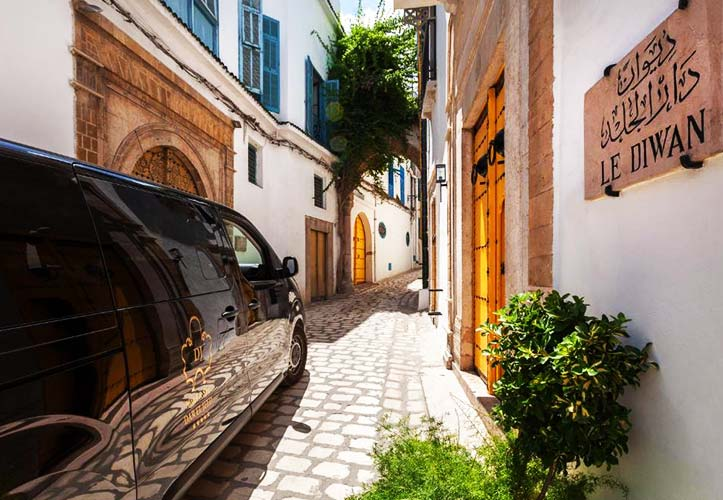

*Accommodation:* Dar El Jeld / Villa Bleue (or similar) · *Meals:* Dinner

**Day 2 — Tunis: Medina, Bardo, Carthage & Sidi Bou Saïd.**
Begin with a guided walk of the UNESCO **Tunis Medina** (Zitouna Mosque exterior, souks, historic palaces). Continue to the **Bardo Museum** — the world's finest collection of Roman mosaics. **Lunch in a local restaurant.** Afternoon at the **Carthage** archaeological site (Phoenician/Roman/Byzantine layers — Byrsa Hill, Antonine Baths). Finish with sunset in the blue-and-white village of **Sidi Bou Saïd**. *Driving: light, all greater Tunis.*

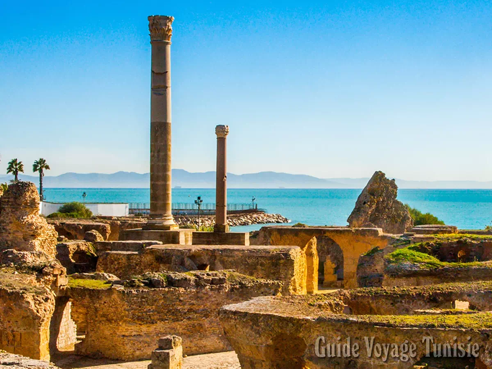

*Accommodation:* Dar El Jeld / Villa Bleue (or similar) · *Meals:* Breakfast, Lunch

**Day 3 — Testour, Dougga & Kairouan.**
Drive west to Testour (Andalusian-Moorish heritage town, unique mosque). On to **Dougga (UNESCO)** — the best-preserved Roman town in North Africa; 2–2.5h guided walk. Lunch. Drive south to **Kairouan (UNESCO)**, Islam's fourth holiest city; visit the old medina and taste the local **Makroudh** pastry. Overnight Kairouan. *Driving: ~3.5h total, broken by sites.*

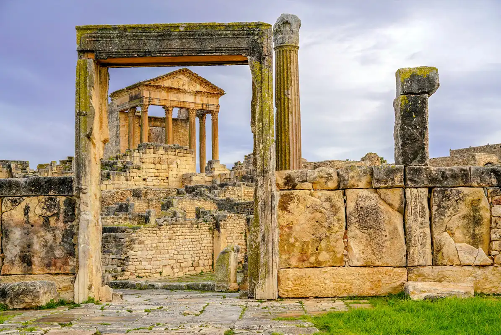

*Accommodation:* Kasbah Kairouan 5★ (or similar) · *Meals:* Breakfast, Lunch

**Day 4 — Kairouan, Sbeitla & Tozeur.** *(Long leg — engineered with breaks.)*
Morning: Great Mosque of Kairouan + Aghlabid basins. Drive to **Sbeitla (Sufetula)** — magnificent Roman forum & three temples; guided visit + lunch. Continue to **Tozeur**, gateway to the Sahara, palm oasis town with distinctive brick architecture. Overnight Tozeur. *Driving: the trip's longest day (~4.5–5h split by Sbeitla).*

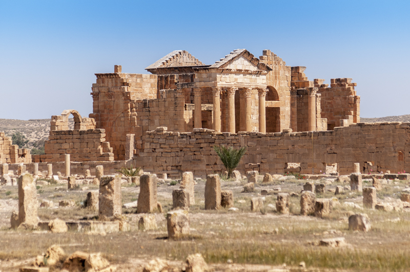

*Accommodation:* The Mora / Dar Tozeur (or similar) · *Meals:* Breakfast, Lunch

**Day 5 — Mountain Oases & Canyons.**
4x4 excursion to the **mountain oases of Chebika, Tamerza and Midès** (canyons, waterfalls, palmeraies on the Algerian frontier). Visit the **Mos Espa** Star Wars film set near Tozeur (light-touch, optional). Afternoon: Tozeur old town (Ouled el Hadef quarter). Overnight Tozeur. *Driving: 4x4 day, scenic.*

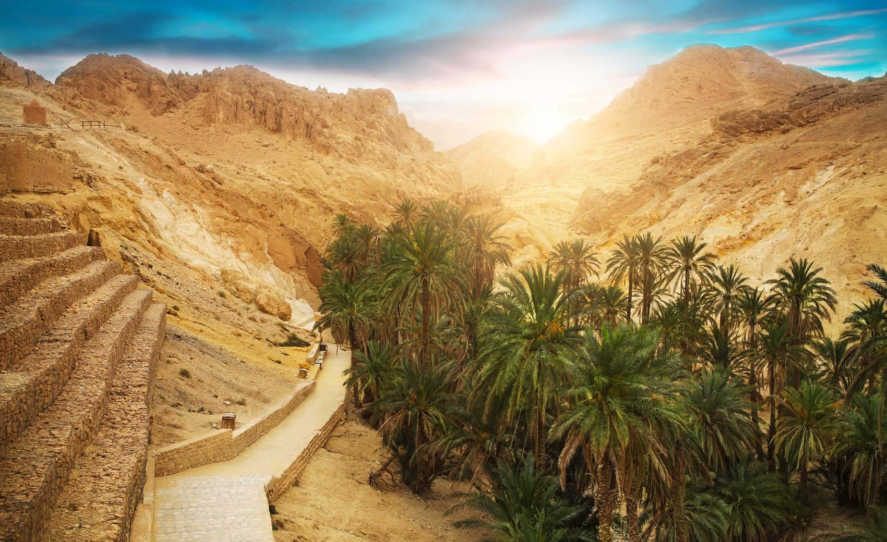

*Accommodation:* The Mora / Dar Tozeur (or similar) · *Meals:* Breakfast

**Day 6 — Chott el Jerid & Night in the Sahara.**
Cross the **Chott el Jerid** salt lake (mirage country) with a photo stop, and see the hot-spring channels used to irrigate the palm groves. Arrive in **Douz** (the "gateway to the Sahara") for lunch and a visit to the **Douz Bedouin Museum**, then continue to the **Sabria camp** at the edge of the Grand Erg Oriental. Meet the camel handlers and ride into the heart of the dunes to settle in the middle of nowhere — help the team gather wood and build the campfire, with dinner prepared on site and a **night of wild bivouac under the stars**. *(Guests who prefer more comfort can return to the permanent camp for the night in en-suite, air-conditioned "luxe nomad" tents.)* Star-gazing, **Berber music & storytelling by local performers**, traditional dinner. *Driving: ~3–4h + transfer to camp.*

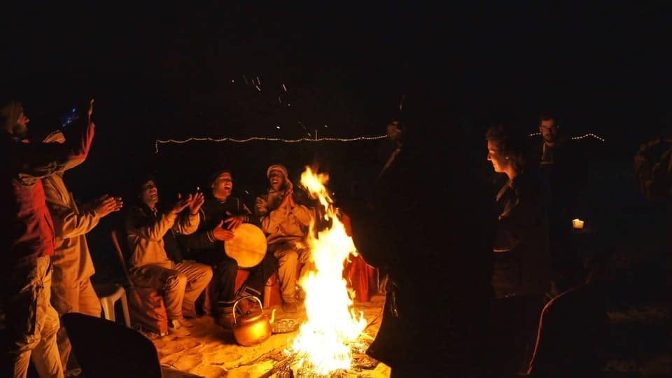

*Accommodation:* Sabria / Dunes Insolites desert camp (or similar) · *Meals:* Breakfast, Dinner

**Day 7 — Tamazret, Matmata & a Troglodyte Night.**
Leave the Sabria camp and drive into the Berber highlands. Visit **Tamazret** and **Matmata**, famous for its troglodyte underground Berber dwellings (with a visit to a family home). Tonight is a genuine local experience: **overnight in a restored troglodyte house — Au Trait d'Union, Tijma.** *Driving: ~3h split by stops.*

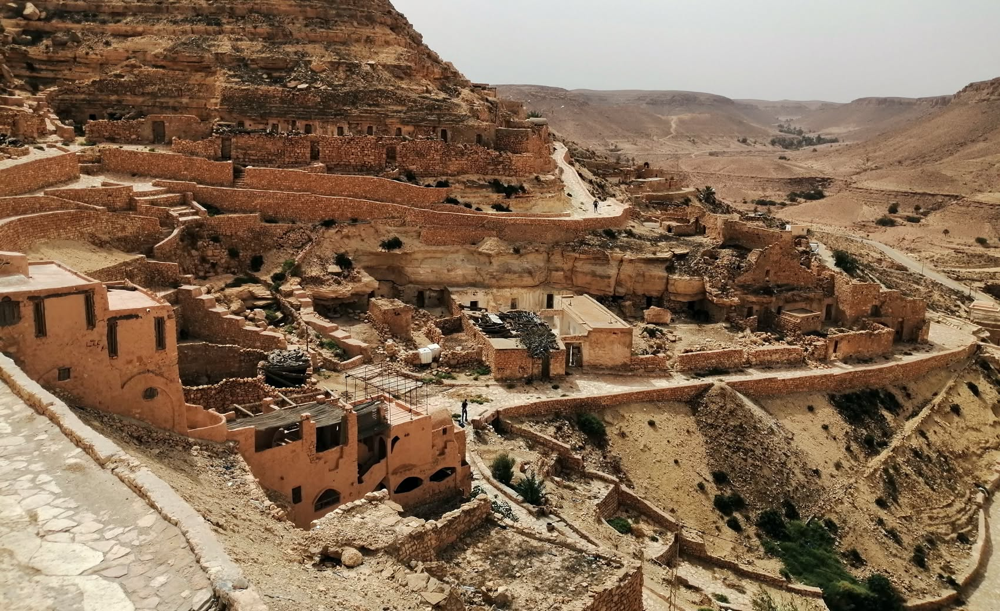

*Accommodation:* Au Trait d'Union, Tijma — troglodyte guesthouse (local experience) · *Meals:* Breakfast, Dinner

**Day 8 — Ksar Hadada, Chenini & to Djerba.**
Morning among the ksour of the south: **Ksar Hadada** (a *Star Wars* filming location) and the dramatic hilltop Berber village of **Chenini** with its iconic white mosque. In the afternoon, drive to the island of **Djerba** via the Roman causeway (El Kantara) for the night. *Driving: ~3–4h split by stops.*

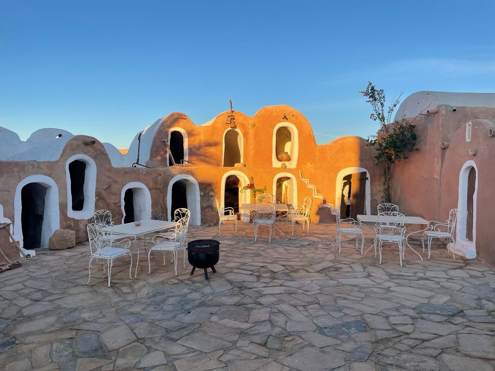

*Accommodation:* Dar Dhiafa (or similar) · *Meals:* Breakfast

**Day 9 — Djerba Island (Cultural).**
*Cultural* Djerba: **El Ghriba**, one of the oldest synagogues in the world & living Jewish-Berber heritage; **Houmt Souk** old town & fishing port; **Guellala** pottery workshops; and the **Djerbahood** street-art quarter. Overnight Djerba. *Driving: light, island-based.* *(Kept cultural, not beach — protects brand positioning.)*

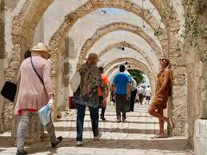

*Accommodation:* Dar Dhiafa (or similar) · *Meals:* Breakfast

**Day 10 — El Jem & Sousse.**
Drive north to **El Jem (UNESCO)** — the colossal Roman amphitheatre (one of the largest in the world) + mosaic museum. Lunch. Continue to **Sousse**; guided visit of the **UNESCO Medina**, Ribat and Great Mosque. Overnight Sousse. *Driving: ~2.5–3h split by El Jem.*

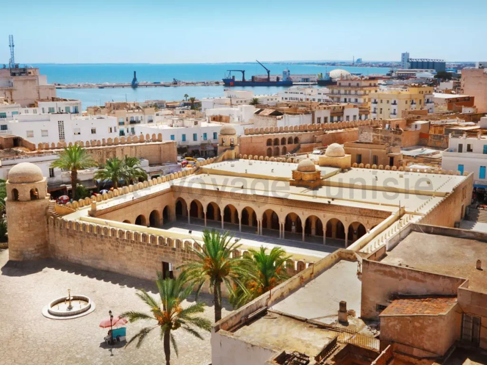

*Accommodation:* Dar Badiaa (or similar) · *Meals:* Breakfast, Lunch

**Day 11 — Hammamet.**
Coastal drive to **Hammamet**: the Kasbah and old medina, the Andalusian quarter, and **Dar Sebastian / International Cultural Centre** gardens. Afternoon at leisure / optional hammam or **wine tasting at a local vineyard**. Farewell dinner. Overnight Hammamet. *Driving: ~1h.*

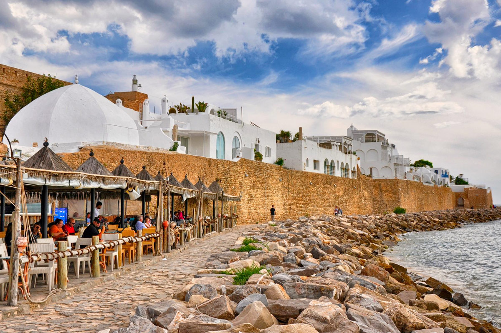

*Accommodation:* Villa Zembra (or similar) · *Meals:* Breakfast, Dinner

**Day 12 — Departure.**
Transfer to Enfidha–Hammamet or Tunis–Carthage airport. *Driving: 30–60 min depending on airport.*

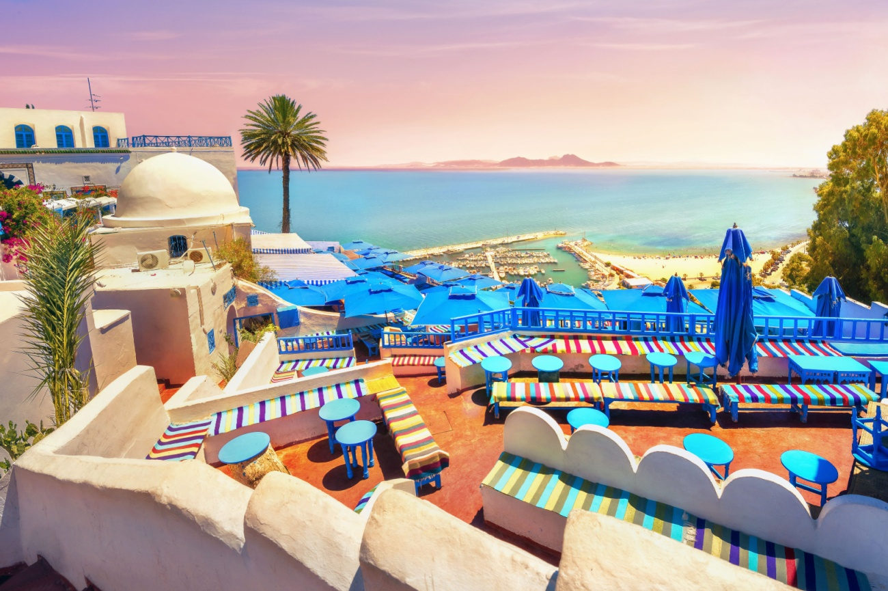

*Meals:* Breakfast

---

## 2.2 ACCOMMODATION CONCEPTS

Locally-owned boutique and heritage properties throughout. Proposed hotels by location *(or similar)*:

| Night(s) | Location | Proposed hotels |
|---|---|---|
| 1–2, (12) | Tunis / Sidi Bou Saïd | Dar El Jeld · Villa Bleue, Sidi Bou Saïd · Hôtel Belvédère Fourati 4★ |
| 3 | Kairouan | Kasbah Kairouan 5★ |
| 4–5 | Tozeur | Tamerza Palace |
| 6 | Douz / Sabria | Dunes Insolites desert camp (en-suite, air-conditioned tents) |
| 7 | Tijma (Matmata area) | Au Trait d'Union — restored troglodyte guesthouse (authentic local stay) |
| 8–9 | Djerba | Dar Dhiafa · Dar Bhar · Villa Azur |
| 10 | Sousse | Mövenpick · Dar Badiaa |
| 11 | Hammamet | Villa Zembra · Dar Khayem Hotel |

**Principle:** locally-owned, characterful, story-rich properties; single rooms on request.

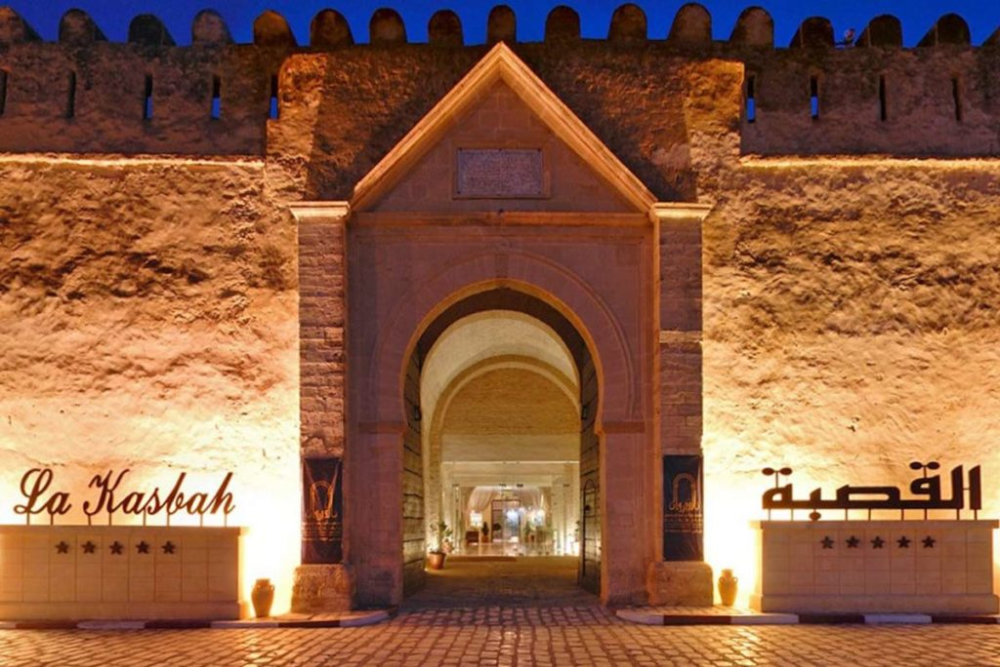
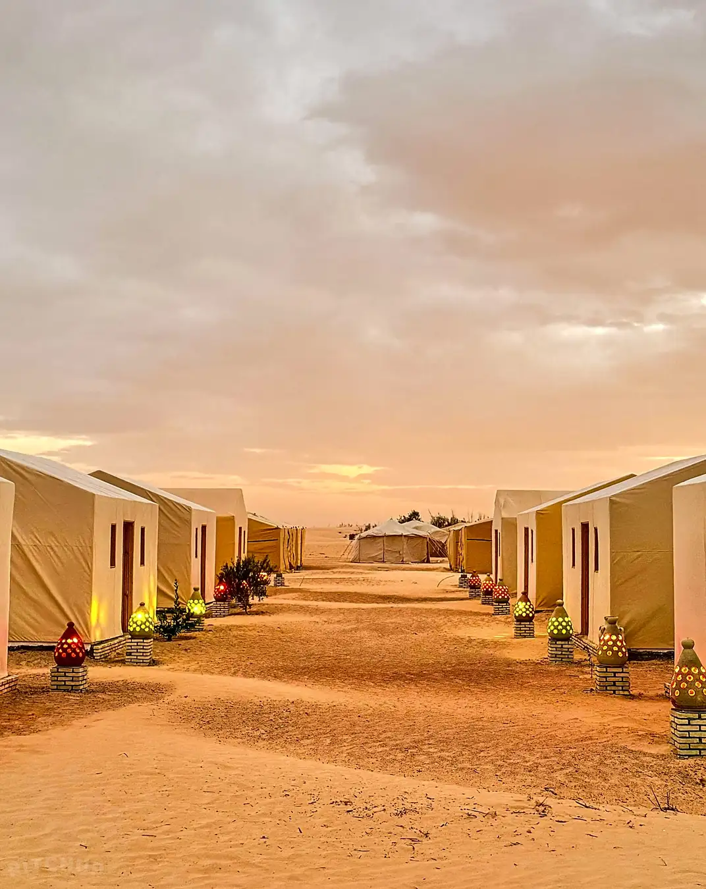

---

## 2.3 INCLUDED SERVICES
- All accommodation (11 nights) as above, on B&B basis unless noted
- Daily breakfast; welcome dinner (Day 1); desert-camp dinner (Day 6); farewell dinner (Day 11); **lunches on full touring days in local restaurants** — *final meal plan to be confirmed at contracting*
- All ground transport in private A/C vehicle; 4x4 for Day 5 and desert access Day 6
- **Highway/motorway parking and fuel expenses**
- **Expert English-speaking national tour leader throughout the whole tour** + qualified local site guides at major sites
- All listed entrance fees (Bardo, Carthage, Dougga, Sbeitla, El Jem, Kairouan monuments, Sousse, El Ghriba, museums)
- Camel/dune activity at desert camp
- Group arrival & departure transfers
- Accommodation on a twin-share basis (**no compulsory single supplement** — solo travellers paired same-sex at no extra cost; optional private room available)
- All taxes and DMC service charges
- One free tour-leader place (free-place ratio per departure to be confirmed at contracting)

## 2.4 EXCLUDED SERVICES
- International flights (land-only pricing)
- Travel insurance (mandatory)
- Visa (where applicable — most target markets visa-free)
- Lunches/dinners not listed; drinks
- Tips/gratuities (leader, drivers, guides)
- Optional activities (e.g. hammam, vineyard tasting, private boat)
- Optional private-room supplement; personal expenses

---

## 2.5 RESPONSIBLE TRAVEL — *Thriving Nature, Thriving People*

*Designed to align with Exodus's B Corp values and its two pillars. Indicative metrics below are Depart Travel commitments for this product, ready to be measured and reported in your format.*

**Thriving People (local benefit):**
- **~95% of accommodation locally owned** (boutique *dars*, oasis & island guesthouses, Berber *ksar*, local desert camp)
- **~90% of included meals at locally-owned restaurants** and family kitchens
- Direct, fair payment to artisans and hosts: Matmata Berber family home, Guellala potters, Djerba weavers, Berber musicians at the camp — arranged with consent and cultural respect
- Spend retained in-country: Tunisian-owned suppliers, local guides and drivers throughout

**Thriving Nature (lower impact):**
- Small groups to limit site pressure; uncrowded, off-peak sites reduce over-tourism load
- Desert camp: solar lighting, strict water-use limits, pack-in/pack-out waste policy
- Reusable water refills on board (no single-use plastic bottles)
- Support for UNESCO site preservation via official entrance fees; seasonal local-produce menus
- Indicative **CO₂e per person per night** provided; happy to validate via Exodus's **eCollective** methodology and flag for the **Lower Carbon Collection**

**Animal welfare:** fully aligned with **ABTA Animal Welfare Guidelines** — no captive-wild-animal interactions or performances. Camel encounters are welfare-compliant: well-kept working animals, limited ride duration, shade and water, no overloading; the camel ride is always optional.

## 2.6 PRICING STRUCTURE — NET RATES BY GROUP SIZE

> ⚠️ **ILLUSTRATIVE FIGURES (EUR).** The amounts below are a realistic working model to show how the grid behaves by group size. They are **not a contracted quote** — final net rates will be confirmed at contracting against live supplier costs and the agreed accommodation list.

**Why the price falls as the group grows:** the trip's **fixed costs** (tour leader, vehicle + driver, 4x4 day, desert-camp logistics) are the same whatever the group size, so they are spread across more travellers. The **variable costs** (accommodation, meals, entrance fees, camp activity) stay broadly constant per person.

### Net land cost — per person, twin share (12 days / 11 nights)

| Group size (paying pax) | Net land cost p.p. (twin share) | Single supplement |
|---|---|---|
| 2 pax (private) | **€2,952** | €420 |
| 4 pax | **€1,992** | €420 |
| 6 pax | **€1,873** | €420 |
| 8 pax | **€1,663** | €420 |
| 10 pax | **€1,397** | €420 |
| 12 pax | **€1,283** | €420 |
| 14 pax | **€1,222** | €420 |
| 16 pax | **€1,158** | €420 |

*Quoted at the lower bound of each tier (worst case for cost coverage). Shoulder season (Mar–May / Oct–Nov). Net to Exodus, before Exodus margin and international air.*

### Indicative cost build-up (per departure)

**Fixed costs (per group, ~€5,000):**
- Tour leader — 12 days (fee, accommodation, meals, per diem)
- Private A/C vehicle + driver — 12 days (incl. fuel, highway parking)
- 4x4 excursion day (Day 5) + desert access (Day 6)
- Desert camp / Sabria logistics & coordination

**Variable costs (per person, ~€1,095 twin share):**
- Accommodation — 11 nights, boutique/heritage, B&B
- Included meals (welcome dinner, camp dinner, farewell dinner, touring-day lunches)
- All listed entrance fees (Bardo, Carthage, Dougga, Sbeitla, El Jem, Kairouan, Sousse, El Ghriba, museums)
- Camel ride / desert-camp activity; bottled-water refills

### Pricing rules & terms
- **Free-place ratio:** 1 free tour-leader place per 15 paying pax (to be agreed).
- **Seasonal bands:** shoulder (Mar–May / Oct–Nov) as above; low season approx. −10%; not operated Jun–Aug (desert heat).
- **Private / tailor-made:** the 2-pax line is the private-departure rate; bespoke versions quoted on a separate grid.
- **Excludes:** international flights, insurance, visa (where applicable), tips, optional activities, and any meals/drinks not listed.
- **Child / triple / FIT policies**, validity dates, payment terms, cancellation/amendment policy and allotment release periods to be specified in the contract.

### Net rates — Highlights of Tunisia (8-day variant)

> ⚠️ **ILLUSTRATIVE FIGURES (EUR).** Same modelling basis as above. The 8-day product has no Sahara-camp night and shorter leader/vehicle days, so both fixed and variable costs are lower.

| Group size (paying pax) | Net land cost p.p. (twin share) | Single supplement |
|---|---|---|
| 2 pax (private) | **€1,770** | €265 |
| 4 pax | **€1,270** | €265 |
| 6 pax | **€1,120** | €265 |
| 8 pax | **€1,504** | €265 |
| 10 pax | **€999** | €265 |
| 12 pax | **€969** | €265 |
| 14 pax | **€947** | €265 |
| 16 pax | **€931** | €265 |

*Quoted at the lower bound of each tier. Shoulder season (Mar–May / Oct–Nov); low season approx. −10%. Net to Exodus, before Exodus margin and international air. 7 nights boutique/heritage B&B; included meals: welcome dinner, two touring-day lunches, farewell dinner; all listed entrance fees and the 4x4 excursion. Same free-place ratio (1 per 15) and terms as the 12-day product.*

## 2.7 GUIDING, SAFETY & CREDENTIALS — WHY DEPART TRAVEL

*Tour-leader quality is the single most praised — and most complained-about — element of any small-group operator. It is our headline commitment.*

**Guiding (the heart of the product):**
- **ONTT-certified, officially-licensed, English-speaking national tour leaders**, present arrival-to-departure, supported by accredited local site guides at major monuments
- Expert, narrative-driven storytelling — history brought alive, not recited
- **Named guide bios + CVs supplied before contracting**; Exodus may **interview/meet the proposed guide(s)** (in person or by video call) before final confirmation
- Consistency safeguards: a small, vetted core team and a documented briefing standard per itinerary, so the experience does not vary departure-to-departure

**Transport & fleet:**
- **Own insured vehicle fleet**; modern A/C minibuses/coaches; vetted 4x4s for the desert and mountain oases; **ONTT-approved, licensed, insured drivers**

**Health, safety & crisis support:**
- Activities operated to local legal standards; **annual route & supplier risk assessments**
- **24/7 in-country assistance** and a local emergency-response protocol; coordination with Exodus's medical/repatriation teams
- Vetted accommodation and restaurants (hygiene, capacity, consistency); backup properties identified per location

**Ethics & compliance:**
- Willing to **sign Exodus's human-rights / ethical-procurement commitment** (UN Guiding Principles, ILO Declaration) as a condition of partnership
- Animal-welfare aligned (ABTA guidelines); local-benefit metrics reported in your format

**Desert camp:** confirmed permanent-camp partner meeting H&S and sustainability standards — and **soon to be a camp fully owned and operated by Depart Travel**, giving Exodus direct quality control over the Sahara night.

**About Depart Travel Services:** a Djerba-based Tunisian DMC specialising in tailor-made and small-group journeys, with deep expertise across both the classical north and the Berber/Sahara south, an own insured fleet, and 24/7 operational support.

# 3. TAILOR-MADE TOURS

Every itinerary in this catalogue can be **fully tailored** to Exodus's specifications — duration, grading, accommodation tier, group size, private departures, theme emphasis (Roman / Berber / culinary / walking), and seasonal dates.

> ### ⏱️ A reply within 72 hours — **guaranteed**
> Send us your brief and we will respond with a costed proposal **within 72 hours**.

**How to request a tailor-made tour:**
1. Email your brief to **direction@depart-travel-services.com** (or WhatsApp **+216 25 099 589**).
2. Include: travel dates, group size, preferred grading/pace, accommodation tier, and any must-see themes.
3. Receive a costed day-by-day proposal and net-rate quote **within 72 hours**.

---

## CONTACT — DEPART TRAVEL SERVICES

| | |
|---|---|
| **Company** | Depart Travel Services — Licensed Travel Agency (Tunisia) |
| **Website** | https://depart-travel-services.com/fr/ |
| **Email** | direction@depart-travel-services.com |
| **Phone / WhatsApp** | +216 25 099 589 |

<!-- 📷 Company logo here, and a closing image: Tunisian hospitality / mint tea / medina rooftop -->

— *Prepared by Depart Travel Services for Exodus Adventure Travels, June 2026.*
