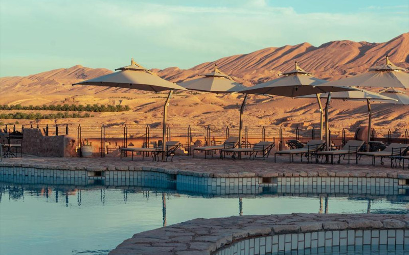

<!-- COVER set in build_pdf.py -->

# HIGHLIGHTS OF TUNISIA — 8 DAYS
### Roman cities, Kairouan, the Sahara & a troglodyte night

**Prepared by Depart Travel Services for Exodus Adventure Travels**
**New for 2026 — proposed product**
**Activity Level:** 3 — Moderate · **Comfort Level:** Classic · **Activity:** Culture

**Contact:** Depart Travel Services · direction@depart-travel-services.com · +216 25 099 589 · https://depart-travel-services.com/fr/

---

## Overview
**A short, immersive week — from the mosaics of Carthage to a night in the Sahara and a stay in a Berber troglodyte house.**

This compact loop packs the very best of Tunisia into eight days: the medina and Bardo mosaics of Tunis, the ruins of Carthage, the holy city of Kairouan, the palm oases and canyons of the south, a crossing of the Chott el Jerid salt lake to a desert camp in the dunes, the troglodyte Berber world of Matmata and Tamazret — with an authentic overnight in a troglodyte house — and finally the colossal amphitheatre of El Jem and the Mediterranean coast. Short transfers, uncrowded sites and genuine local encounters throughout.

## Key Information
- **Trip Code:** THT *(proposed)*
- **Ways to Travel:** Guided Group (also private / tailor-made)
- **Countries:** Tunisia
- **Duration:** 8 days / 7 nights
- **Group size:** small group, typically 8–16 (guaranteed from 2); also private / tailor-made
- **Flights:** land-only; **Tunis (TUN) in and out** — fully compatible with UK/Europe scheduled services
- **Carbon Footprint:** est. ~34 kg CO₂e **per person per night** (in-trip, excl. flights — indicative, to be validated via eCollective)

## What's Included
- All accommodation: 7 nights (boutique/heritage hotels, 1 night desert camp, 1 night troglodyte guesthouse)
- All breakfasts and selected meals (welcome dinner, touring-day lunches, desert-camp dinner, troglodyte-house dinner, farewell dinner)
- Immersive itinerary with all listed transport, 4x4 excursion and activities
- Expert, ONTT-certified English-speaking tour leader throughout + local site guides
- All listed entrance fees
- Arrival and departure transfers
- Twin-share accommodation — **no compulsory single supplement** (solo travellers paired same-sex at no extra cost; optional private room available)

## What's Not Included
International flights · travel insurance · visas (most markets visa-free) · meals/drinks not listed · tips · optional activities · optional private-room supplement.

## Highlights
- Tour crowd-free Roman Tunisia: **Carthage, El Jem and the holy city of Kairouan**
- **Cross the Chott el Jerid and sleep in a Sahara desert camp** among the dunes
- Discover the **troglodyte Berber world of Matmata & Tamazret** — with a night in a troglodyte house

## Itinerary

**Day 1: Adventure starts in Tunis**
Arrival transfer and evening welcome dinner in a restored medina townhouse.
*Accommodation:* Dar El Jeld / Villa Bleue (or similar) · *Meals:* Dinner

**Day 2: Medina, Bardo, Carthage & Sidi Bou Saïd**
The UNESCO medina, the world-class Bardo mosaics, the ruins of Carthage and sunset in blue-and-white Sidi Bou Saïd.
*Accommodation:* Dar El Jeld / Villa Bleue (or similar) · *Meals:* Breakfast

**Day 3: Kairouan • To Tozeur**
The holy city of Kairouan — Great Mosque, old medina and Makroudh pastry — then on to the oasis town of Tozeur.
*Accommodation:* Tamerza Palace (or similar) · *Meals:* Breakfast, Lunch

**Day 4: Mountain oases • Chott el Jerid • Sahara camp**
4x4 to the mountain oases of Chebika, Tamerza and Midès, with lunch, then cross the **Chott el Jerid** salt lake and head to the **Dunes Insolites** desert camp for a night among the dunes.
*Accommodation:* Dunes Insolites desert camp (or similar) · *Meals:* Breakfast, Lunch, Dinner

**Day 5: Sabria & Douz • Tamazret & Matmata • Troglodyte night**
From Sabria to Douz (gateway to the Sahara), then into the Berber highlands of Tamazret and Matmata, with its troglodyte underground dwellings. Tonight, an authentic stay in a restored troglodyte house.
*Accommodation:* Au Trait d'Union, Tijma — troglodyte guesthouse · *Meals:* Breakfast, Dinner

**Day 6: El Jem & Sousse**
Drive north to the colossal Roman amphitheatre of **El Jem**, then the UNESCO medina and Ribat of **Sousse**.
*Accommodation:* Mövenpick / Dar Badiaa, Sousse (or similar) · *Meals:* Breakfast

**Day 7: Hammamet • Wine tasting • To Tunis**
The Kasbah and Andalusian quarter of Hammamet, with a **wine tasting at a local vineyard**, then transfer to Tunis for the final night and farewell dinner.
*Accommodation:* Dar El Jeld / Villa Bleue (or similar) · *Meals:* Breakfast, Dinner

**Day 8: Adventure ends in Tunis**
Departure transfer to Tunis–Carthage airport.
*Meals:* Breakfast

## Dates & Prices *(illustrative, excl. flights)*
**Open departures — choose your own dates** across the spring and autumn seasons (Mar–May and Oct–Nov). **Guaranteed from just 2 participants.**

- **From £1,195 p.p.** (twin share, excl. flights)
- **Optional private-room supplement:** +£220 *(no compulsory single supplement — solos paired same-sex at no cost)*
- **Private & tailor-made** dates available year-round on request.

## Accommodation
Locally-owned boutique and heritage properties throughout. Proposed hotels by location *(or similar)*:

| Location | Proposed hotels |
|---|---|
| Tunis | Dar El Jeld · Villa Bleue, Sidi Bou Saïd · Hôtel Belvédère Fourati 4★ |
| Kairouan / Tozeur | Tamerza Palace |
| Sahara / Sabria | Dunes Insolites desert camp |
| Tijma (Matmata) | Au Trait d'Union — troglodyte guesthouse |
| Sousse | Mövenpick · Dar Badiaa |

Single rooms on request.

## Responsible Travel
Aligned with Exodus's *Thriving Nature, Thriving People*: ~95% locally-owned accommodation and ~90% of meals at locally-owned restaurants; fair, direct payment to Berber hosts and artisans (including the troglodyte-house stay); small groups on uncrowded sites; welfare-compliant camel encounters (ABTA-aligned, always optional); reusable water refills; indicative CO₂e per night, ready to validate via eCollective.

## Essential Info
Activity Level 3 (Moderate): easy-to-moderate walking on uneven ground; one desert-camp night and one troglodyte-house night; short transfers. Solo-friendly; no compulsory single supplement. Best in spring (Mar–May) and autumn (Oct–Nov); not operated in high summer (desert heat). Full Trip Notes / Essential Trip Information available on request.

— *Prepared by Depart Travel Services for Exodus Adventure Travels, 2026.*
